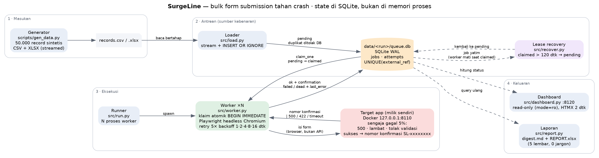
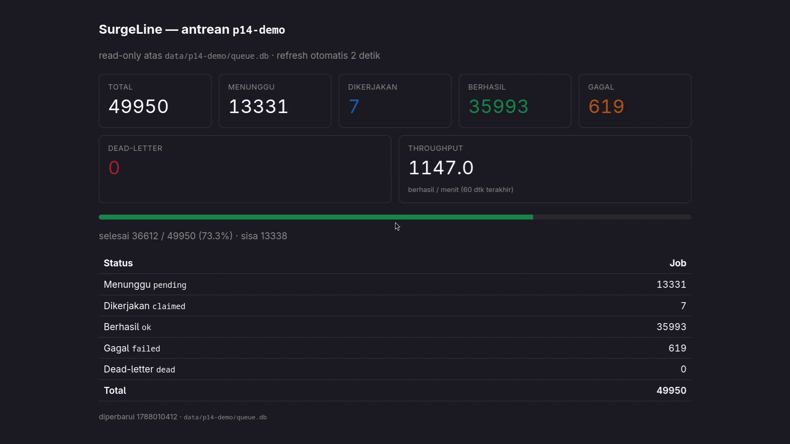
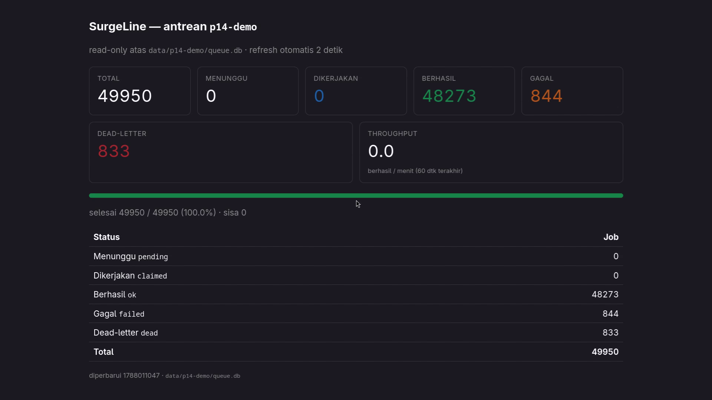

# SurgeLine

> **50.000 form dikirim otomatis. Dimatikan paksa dua kali di tengah jalan.
> Tetap selesai 100%, nol duplikat.**

Sistem pengiriman form massal untuk platform yang **tidak punya API** — data dari Excel/CSV
masuk antrean, dikerjakan beberapa worker browser secara paralel, dan setiap pengiriman yang
berhasil menyimpan **nomor konfirmasi** dari halaman hasil.



---

## Legal — dibaca lebih dulu

SurgeLine **hanya** diuji terhadap target milik sendiri: sebuah aplikasi form yang saya tulis
dan jalankan sebagai container Docker di `127.0.0.1`. Sistem ini tidak pernah diarahkan ke
situs pihak lain, tidak menembus captcha/anti-bot, dan seluruh 50.000 data uji 100% sintetis
(tanpa data orang sungguhan). Pagar itu ada di dalam kode: worker menolak URL di luar
`127.0.0.1`/`localhost`.

Pertanyaan pertama saya ke klien selalu tiga: **apakah platformnya punya API? berapa rate limit
resminya? mana bukti otorisasinya?** Kalau sebuah target butuh bypass proteksi untuk ditembus,
jawaban yang benar adalah berhenti dan menanyakan otorisasi — bukan mencari celah.
Selengkapnya: [`docs/ETHICS.md`](docs/ETHICS.md) dan [`docs/CONSULTATION.md`](docs/CONSULTATION.md).

---

## Momen yang penting: dimatikan di tengah jalan

Otomasi bulk yang rapuh selalu gagal di titik yang sama — mati di record ke-23.000, lalu tidak
ada yang tahu mana yang sudah terkirim dan mana yang belum. Jalan keluarnya biasanya: ulangi
dari nol dan terima kiriman ganda.

SurgeLine dibuat supaya itu tidak mungkin terjadi. Pada run penuh 50.000 record, proses
**dimatikan paksa (`kill -9`) dua kali** di tengah jalan:

| Saat | Berhasil terkirim |
|---|---|
| sebelum kill pertama | 10.621 |
| sebelum kill kedua | 21.508 |
| setelah dinyalakan lagi hingga selesai | 48.273 |

Hasil akhir: **49.950 job selesai seluruhnya** (`pending` + `claimed` = 0), **7 job yatim**
(dibawa mati worker saat berstatus `claimed`) ditarik kembali oleh lease dan semuanya berakhir
`ok`, **duplikat 0** — baik duplikat data maupun duplikat nomor konfirmasi.

```sql
SELECT COUNT(*)-COUNT(DISTINCT external_ref) FROM jobs;                        -- 0
SELECT COUNT(*)-COUNT(DISTINCT confirmation) FROM jobs WHERE status='ok';      -- 0
SELECT COUNT(*) FROM jobs WHERE status IN ('pending','claimed');               -- 0
```

Bukti lengkap dengan log dan hitungan sebelum/sesudah: [`docs/RESUME_PROOF.md`](docs/RESUME_PROOF.md).

**Lihat sendiri:** [`assets/demo.mp4`](assets/demo.mp4) — 1 menit 54 detik, dashboard hidup
dipercepat 10×, dua kali dimatikan paksa, ditutup query ke database. Tiga tangkapan layar dari
run yang sama: [sebelum](assets/before.png) · [saat dimatikan](assets/crash.png) ·
[setelah selesai](assets/after.png).

| | |
|---|---|
|  |  |
| Detik proses dimatikan: angka membeku, 7 job `claimed` ikut mati bersama worker, laju turun. | Setelah dinyalakan lagi: 49.950 / 49.950 selesai, `pending` 0, `claimed` 0. |

### Kenapa ini struktural, bukan kebetulan

- **State ada di database, bukan di memori proses.** Worker mati → job tetap `pending` atau
  `claimed` di SQLite; tidak ada kemajuan yang hilang bersama prosesnya.
- **Duplikat ditolak oleh database**, lewat `UNIQUE(external_ref)` + `INSERT OR IGNORE`. File
  yang sama boleh dimuat berkali-kali; barisnya tetap satu.
- **Klaim antar worker atomik** (`BEGIN IMMEDIATE`): dua worker tidak pernah mengerjakan job yang sama.
- **Lease timeout 120 detik**: job yang "dibawa mati" worker kembali ke antrean, tidak hilang selamanya.
- **Nomor konfirmasi adalah bukti**: satu data → paling banyak satu nomor konfirmasi.

---

## Angka nyata (bukan perkiraan)

Semua angka di bawah berasal dari query ke database hasil run, bukan estimasi.

| | |
|---|---|
| Data diproses | **49.950** (50.000 baris, 50 duplikat ditolak database) |
| Berhasil + nomor konfirmasi tersimpan | **48.273** (96,6%) — 0 sukses tanpa nomor konfirmasi |
| Ditolak validasi target (permanen, tidak di-retry) | 844 — alasannya tercatat satu per satu |
| Habis 5 percobaan (dead-letter) | 833 — semuanya punya pesan kesalahan terakhir |
| Duplikat data / duplikat nomor konfirmasi | **0 / 0** |
| Lama run | 47 menit 16 detik (4 worker, termasuk 2 kali dimatikan paksa) |
| Kecepatan terukur | **81.915 data/jam** pada 8 worker (titik jenuh; 12 worker hanya +4,2%) |
| Ekstrapolasi 6 juta data | ± 3,0 hari berjalan terus — [`docs/THROUGHPUT.md`](docs/THROUGHPUT.md) |
| Impor 50.000 baris Excel | memori datar: 10k = 50.600 KiB → 50k = 57.044 KiB (+12,7%, bukan 5×) |

Target uji **sengaja gagal 5%** dari seluruh request, terbagi tiga mode (HTTP 500, respons
lambat, penolakan validasi) dan deterministik berdasar seed — supaya run bisa diulang dan
ketahanan worker benar-benar terukur, bukan diasumsikan. Kegagalan itu fitur laboratorium,
bukan bug: yang diuji adalah apa yang dilakukan sistem **saat** target rusak.

---

## Cara menjalankan

Butuh: Python 3.13, [`uv`](https://docs.astral.sh/uv/), Docker, `sqlite3`. Tanpa server database,
tanpa message queue, tanpa layanan cloud — antrean cukup satu file SQLite.

```bash
make setup      # dependency terkunci (uv.lock) + Chromium Playwright
make all        # target app -> 50.000 data -> antrean -> worker -> laporan -> gerbang bukti
```

`make all` berhenti dengan galat kalau antrean belum tuntas, ada duplikat, atau ada sukses tanpa
nomor konfirmasi. Selama run berjalan, `make dashboard` menyalakan halaman status read-only di
`127.0.0.1:8120` yang angkanya cocok 1:1 dengan isi database.

| Perintah | Kegunaan |
|---|---|
| `make target-up` | nyalakan aplikasi form target (Docker, `127.0.0.1:8110`) |
| `make gen-data` | 50.000 record sintetis → CSV + XLSX (streamed, memori datar) |
| `make load` | muat file ke antrean; duplikat ditolak database |
| `make run` | jalankan N worker sampai antrean habis (`WORKERS=8`) |
| `make recover` | tarik job yatim kembali ke antrean (berdiri sendiri) |
| `make dashboard` | status hidup, read-only |
| `make report` | `reports/digest.md` + `REPORT.xlsx` 5 lembar |
| `make verify` | gerbang bukti: tuntas, duplikat 0, tiap sukses bernomor konfirmasi |
| `make test` · `make audit` | unit test · pindai rahasia & artefak runtime |

Dimatikan di tengah jalan? Jalankan `make run` lagi. Tidak ada langkah pembersihan, tidak ada
"mulai dari nol", tidak ada risiko kiriman ganda.

---

## Laporan untuk klien

Setiap run bisa diringkas jadi laporan yang bisa dibaca orang non-teknis: satu halaman digest
plus `REPORT.xlsx` lima lembar (Ringkasan, Per-status, Kecepatan, Kegagalan, Bukti). Penulis
laporan menolak menulis file kalau ada jargon teknis yang lolos — daftar 51 istilah diperiksa
otomatis. Contoh tersanitasi: [`assets/sample_daily.md`](assets/sample_daily.md) dan
[`assets/sample_REPORT.xlsx`](assets/sample_REPORT.xlsx).

## Yang sengaja tidak dikerjakan

Bukan lingkup project ini: captcha solver, bypass anti-bot, pengiriman ke platform tanpa
wewenang, database eksternal atau message queue sebagai runtime, deploy cloud, multi-user auth,
dan dukungan Windows/macOS. Batasnya ditulis di [`docs/DECISIONS.md`](docs/DECISIONS.md) supaya
tidak melar diam-diam.

## Peta dokumen

| Ingin tahu | Buka |
|---|---|
| arsitektur & alur data | [`docs/ARCHITECTURE.md`](docs/ARCHITECTURE.md) |
| bukti crash-recovery | [`docs/RESUME_PROOF.md`](docs/RESUME_PROOF.md) |
| kecepatan & ekstrapolasi | [`docs/THROUGHPUT.md`](docs/THROUGHPUT.md) |
| bentuk data & tabel antrean | [`docs/SCHEMA.md`](docs/SCHEMA.md) |
| spesifikasi target & mode gagalnya | [`docs/TARGET.md`](docs/TARGET.md), [`docs/CHAOS.md`](docs/CHAOS.md) |
| keputusan teknis yang dikunci | [`docs/DECISIONS.md`](docs/DECISIONS.md) |
| batas etika & legal | [`docs/ETHICS.md`](docs/ETHICS.md) |
| kriteria selesai + perintah pembuktinya | [`docs/ACCEPTANCE.md`](docs/ACCEPTANCE.md) |

Catatan kerja internal (peta fase, status sesi, aturan mesin) ada di `PLAN.md`, `STATE.md`,
`KICKSTART.md`, dan `AGENTS.md`.
